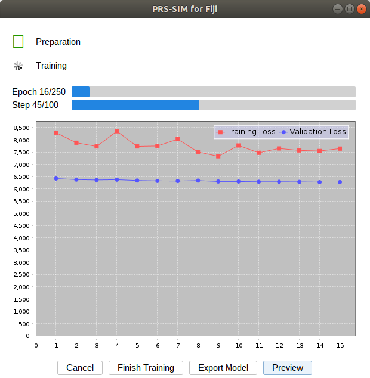

# Tutorial of PRS-SIM Fiji plugin

***

## 1. Installation

You can follow the instructions below to install the plugin:

- Copy `./Fiji-plugin/jars/*` and `./Fiji-plugin/plugins/*` to your root path of Fiji `/*/Fiji.app/`.

- Restart Fiji.

- Start the PRS-SIM Fiji Plugin:

  

****

## 2. Set CPU/GPU and TensorFlow version

The PRS-SIM Fiji plugin was developed based on TensorFlow-Java 1.15.0, which is compatible with CUDA version of 10.0 and cuDNN version of 7.5.1. Before running the plugin with GPU, you should select and install Tensorflow GPU in Fiji by following steps:

- Open **Edit > Options > Tensorflow**, and choose the version matching your model or setting.
- Wait until a message pops up telling you that the library was installed.
- If choose TensorFlow GPU version, please install these NVIDIA requirements to run TensorFlow with GPU support as described in **Edit > Options > Tensorflow**, or GPU support will not work.
- If run ImageJ on Windows machines, please copy `./Fiji-plugin/lib/win64/tensorflow_jni.dll` to `C:/Windows/System32/`.
- Restart Fiji.

  
 Option > Tensorflow" />

Note that GPU Support of TensorFlow in ImageJ is only available for Linux and Windows operating system with NVIDIA graphics cards at the present. Therefore, the PRS-SIM plugin currently runs only with CPU for macOS.

****

## 3. Inference with PRS-SIM Fiji plugin

Given a pre-trained PRS-SIM model and an image or stack to be processed, the Fiji plugin is able to generate the corresponding denoised image or stack. The workflow includes following steps:

- Open the image or stack in Fiji and start PRS-SIM plugin by Clicking **Plugins > PRS-SIM > predict**.

- Select the network model file, i.e., .zip file in the format of Save Model bundle. Of note, the model file could be trained and saved either by Python codes (see [this gist](https://gist.github.com/asimshankar/000b8d276f211f972168afa138eb3cc7)) or PRS-SIM Fiji plugin, but has to be saved with TensorFlow environment <= 1.15.0.

- Check inference hyper-parameters. The options and parameters here are primarily selected to perform tiling prediction to save memory of CPUs or GPUs (Number of tiles and Overlap between tiles), and decide whether to show progress dialog or not
(Show progress dialog).

  

- Please note that when predicting 3D images, make sure the third dimension of the stack is matched with `0[-1]` dimension of the model:

  
 

- Image processing with status bar shown in the message box (if select Show progress dialog).

  
 

- The denoised output will pop out in separate Fiji windows automatically. Then the processed images or stacks could be viewed, manipulated, and saved via Fiji.

****

## 4. Training with PRS-SIM Fiji plugin

For PRS-SIM model training, we provide realigned images dataset which can directly be used for training, and code to process raw SIM images to realigned images. In the latter method, please organize directory structure of your data as below.

>dataset_for_training  
>├─ cell X  
>│    ├─ view1.tif  
>│    ├─ view2.tif  
>│    ├─ view3.tif  
>│    └─ view4.tif  
>...

- Start the plugin by **Plugins > PRS-SIM > train** and select the folder containing reailgned images.

  
 

- Check training hyper-parameters, which include Total number of augmentation, total epochs, iteration number per epoch, batch size and initial learning rate.

- Click OK to start training. A message box containing training information will pop up.

  
 

- Click `Preview` and check the input images and current denoised output images.

  
 

- Three types of exit:
  >(i) Press **Cancel > Close** to enforce an exit if you don't want to train or save this model.
  >
  >(ii) Press **Finish Training** for an early stopping. A window will pop up and you can change the save path and filename.
  >
  >(iii) After the training is completed, A window will pop up and you can change the save path and filename.

  
 

- Of note, you can also press **Export Model** during training to export the lastest saved model without disposing the training progress.
- The model saved in training progress can be used in predict progress directly.

****
## 5. Examples
    

The examples noisy image and denoised image of CCPs and Microtubules is located at the folder './Examples-CCPs' and './Examples-Microtubules'.
Due to the storage limination of Github, we upload the example training dataset on Google drive at https://drive.google.com/drive/folders/1nYSQ5K94SqkoG65_N3Tn2zPL4dt0T0yX?usp=share_link.

